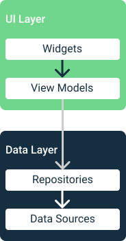
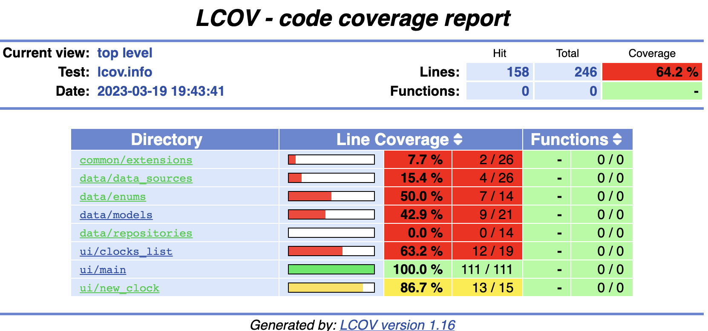
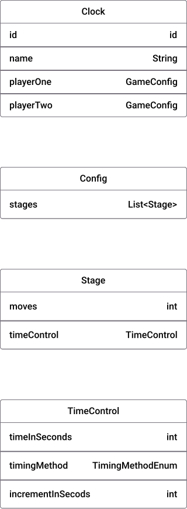

# Chess Clock App

This app is a digital chess clock that allows you to customize your clock's setup to your specific needs. With this app, you can easily keep track of your time during chess games and ensure that each player gets an equal amount of time to make their moves.

## Note

This project is still a work in progress and may contain bugs or incomplete features.

## Features

- Customizable time controls for each player
- Quick and easy start and reset buttons
- Vibrations and sound effects for each move

## Prototype

You can view the Figma prototype for this app at [Figma - Mockup](https://www.figma.com/file/1fp4OtyZiBxaH6Z7dFtY6g/Chess-Clock?node-id=0%3A1&t=1XN2EbQE3C4ReFXW-1).

## Architecture

This app is built using the MVVM (Model-View-ViewModel) architectural pattern, which separates the UI (View) from the business logic (ViewModel) and data (Model). The benefits of using this pattern include better separation of concerns, easier testing, and more maintainable code. You can see a slight difference because in this project the Views are named Widgets.

## Unit tests

## Class Diagrams

The following class diagram illustrates the key classes and their relationships in the app:

## Contributing

If you'd like to contribute to the project, please follow these guidelines:

1. Fork the repository and create a new branch for your changes
2. Make your changes and test them thoroughly
3. Submit a pull request with a clear description of your changes
